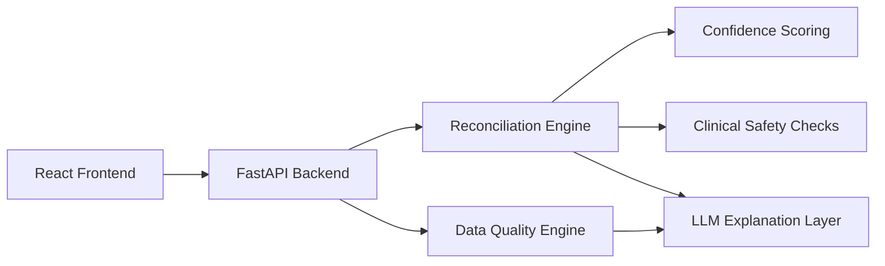

# Clinical Data Reconciliation Engine (Mini Version)

A focused full-stack take-home project for reconciling conflicting medication records and validating chart data quality with AI-assisted reviewer explanations.

This submission is intentionally scoped to the assignment:
- one medication reconciliation workflow
- one data quality validation workflow
- two primary public API endpoints
- a clean clinician-friendly React UI
- deterministic logic with an LLM explanation layer

## Project Overview

The application helps a reviewer answer four questions quickly:
- What does the system think the most likely medication record is?
- Why did it choose that record?
- Is the recommendation clinically safe enough to review or approve?
- Is the underlying patient record complete and plausible?

The product is framed as AI-assisted decision support, not autonomous medical decision-making.

## Stack

- Frontend: React + TypeScript
- Backend: FastAPI + Python
- Validation: Pydantic schemas
- Testing: Vitest and Pytest
- AI: OpenAI API with deterministic fallback
- Caching: in-memory LLM response cache

## Architecture Summary



Key decision:
- deterministic rules remain the source of truth
- the LLM converts structured findings into concise reviewer-facing reasoning

## Public API

The assignment-facing public API is centered on these two endpoints:

### `POST /api/reconcile/medication`

Input:
- `patient_context`
- `sources`

Output:
- `reconciled_medication`
- `confidence_score`
- `reasoning`
- `recommended_actions`
- `clinical_safety_check`

Example request:

```json
{
  "patient_context": {
    "age": 67,
    "conditions": ["Type 2 diabetes", "Hypertension", "Chronic kidney disease"],
    "recent_labs": {
      "egfr": 45
    }
  },
  "sources": [
    {
      "system": "Hospital EHR",
      "medication": "Metformin 1000mg BID",
      "last_updated": "2026-03-10",
      "source_reliability": "high"
    },
    {
      "system": "Primary care",
      "medication": "Metformin 500mg BID",
      "last_updated": "2026-03-12",
      "source_reliability": "high"
    },
    {
      "system": "Retail pharmacy",
      "medication": "Metformin 1000mg daily",
      "last_filled": "2026-03-08",
      "source_reliability": "medium"
    }
  ]
}
```

Example response:

```json
{
  "reconciled_medication": "Metformin 500mg BID",
  "confidence_score": 0.88,
  "reasoning": "Primary care record is the most recent clinician-authored source and better fits the CKD context.",
  "recommended_actions": [
    "Confirm the active dose with the dispensing pharmacy.",
    "Review renal function before final approval."
  ],
  "clinical_safety_check": "REQUIRES_REVIEW"
}
```

### `POST /api/validate/data-quality`

Input:
- `demographics`
- `medications`
- `allergies`
- `conditions`
- `vital_signs`
- `last_updated`

Output:
- `overall_score`
- `breakdown`
- `issues_detected`

Example request:

```json
{
  "demographics": {
    "name": "Jane Doe",
    "dob": "1980-01-01",
    "gender": "F"
  },
  "medications": ["Metformin", "Lisinopril", "Atorvastatin"],
  "allergies": [],
  "conditions": ["Hypertension", "Type 2 diabetes", "Chronic kidney disease"],
  "vital_signs": {
    "blood_pressure": "350/200",
    "heart_rate": 88
  },
  "last_updated": "2025-01-01"
}
```

Example response:

```json
{
  "overall_score": 58,
  "breakdown": {
    "completeness": 80,
    "accuracy": 65,
    "timeliness": 50,
    "clinical_plausibility": 37
  },
  "issues_detected": [
    {
      "field": "vital_signs.blood_pressure",
      "issue": "Blood pressure 350/200 is physiologically implausible",
      "severity": "high"
    },
    {
      "field": "allergies",
      "issue": "No allergies documented - likely incomplete",
      "severity": "medium"
    }
  ]
}
```

## Local Setup

From the repository root:

```bash
python3 -m venv .venv
.venv/bin/pip install -r requirements.txt
cd frontend
npm install
cd ..
```

## Environment Variables

Backend `.env`:

```text
APP_NAME=Clinical Data Reconciliation Engine
APP_VERSION=1.0.0
APP_ENV=development
APP_API_KEY=clinical-demo-key
CORS_ORIGINS=http://127.0.0.1:5173,http://localhost:5173
OPEN_API_KEY=
OPENAI_MODEL=gpt-4o-mini
DATABASE_PATH=backend/data/clinical_reconciliation.db
```

Frontend `frontend/.env`:

```text
VITE_API_BASE_URL=
VITE_APP_API_KEY=clinical-demo-key
```

Leave `VITE_API_BASE_URL` blank in local development so the Vite proxy handles `/api`.

## Run Locally

Stop any old servers first:

```bash
kill $(lsof -ti :8000) 2>/dev/null
kill $(lsof -ti :5173) 2>/dev/null
```

Backend:

```bash
cd "/Users/osamahgilani/Documents/New project/clinical-data-reconciliation-engine"
.venv/bin/uvicorn backend.main:app --host 127.0.0.1 --port 8000 --reload
```

Frontend:

```bash
cd "/Users/osamahgilani/Documents/New project/clinical-data-reconciliation-engine/frontend"
npm run dev -- --host 127.0.0.1 --port 5173
```

Open:
- [UI](http://127.0.0.1:5173/)
- [Swagger](http://127.0.0.1:8000/docs)
- [Health](http://127.0.0.1:8000/health)

## Recommended Demo Flow

The UI opens on a seeded reviewer case designed to show both required workflows quickly.

Suggested 30-second walkthrough:

1. Run `Run Reconciliation`.
2. Call out the selected source, confidence score, rule hits, and clinical safety status.
3. Try `Reject Recommendation` before typing rationale to show the human-in-the-loop guard.
4. Enter a short rationale, then approve, reject, or request manual review.
5. Run `Validate Data Quality`.
6. Open the blocking blood pressure issue and point out the remediation guidance.

Why this case works well in a demo:
- three sources disagree on metformin dose
- CKD context makes the lower dose more plausible
- the chart also contains stale metadata and missing allergy documentation
- the reviewer can see explainability, safety, and quality validation in one pass

## Frontend UX

The UI is intentionally small and reviewer-friendly:

- top summary card with seeded patient context
- medication reconciliation section with source comparison, confidence, reasoning, and approve/reject flow
- data quality section with score breakdown and severity chips
- right-side decision panel showing:
  - reasoning trace
  - confidence factors
  - source trust ranking
  - clinical safety checklist

## Reconciliation Logic

The reconciliation flow uses a hybrid approach:

1. deterministic scoring
2. confidence computation
3. LLM explanation generation
4. structured final response

The confidence score is informed by:
- source reliability
- recency
- agreement between sources
- pharmacy fill timing
- clinical plausibility
- safety concerns

## Data Quality Logic

The validator scores:
- completeness
- accuracy
- timeliness
- clinical plausibility

It flags issues such as:
- missing allergy documentation
- implausible vitals
- stale records
- invalid or inconsistent dates

## LLM Usage

The OpenAI integration is used for:
- concise clinical-style reasoning
- source selection explanation
- recommended follow-up actions
- short data quality summaries

The LLM does not choose the final medication record independently.

### Prompt Design

Prompts are grounded with:
- patient conditions
- recent labs
- source recency
- source reliability
- deterministic rule outputs
- safety flags

Reliability controls:
- deterministic fallback text when the provider is unavailable
- retry/fallback behavior for transient failures
- in-memory cache for repeated prompts
- concise low-creativity explanation prompts

## Tests

Backend:

```bash
.venv/bin/pytest -q tests
```

Frontend:

```bash
cd frontend
npm test -- --run
```

Current coverage includes:
- reconciliation chooses plausible source output
- stale or risky context influences confidence/explanation
- implausible vitals are flagged
- empty allergies are flagged
- API authentication rejects invalid access
- malformed payloads fail schema validation

## Product / Architecture Trade-offs

- I kept the backend logic deterministic and explainable instead of making the LLM the decision-maker.
- I used a focused single-page UI rather than a large clinical operations platform to stay aligned with the take-home scope.
- FastAPI + React was retained because the codebase was already stable and testable in this stack.
- A simple local database exists for development internals, but the main reviewer flow is still centered on the two required API workflows.

## What I Would Improve With More Time

- migrate backend internals to the exact preferred Node/TypeScript stack if required by the reviewer
- add more scenario coverage and visual regression tests
- improve medication normalization with a stronger drug reference dataset
- add hosted deployment and CI screenshots for the final submission
- add more clinician-reviewed heuristics for safety checks

## Estimated Time Spent

Estimated total time: approximately 18-24 hours across backend logic, AI prompting, frontend UX, testing, and documentation.
