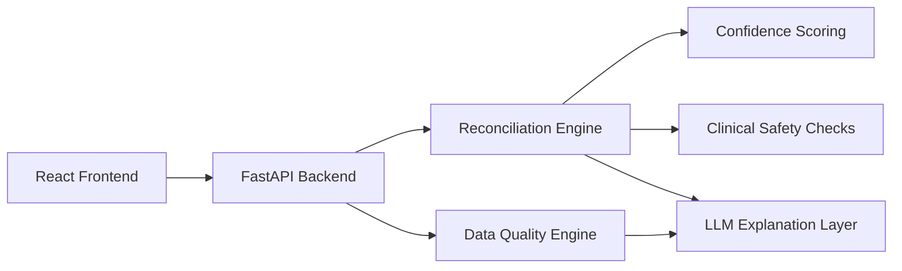

# Clinical Data Reconciliation Engine

AI-assisted medication reconciliation and chart quality review for a clinician-facing take-home assessment.

## 🎥 Demo Video:
https://youtu.be/LvKegi20h4E?si=T7rDsODaMIlw_Z9G

## 📊 Presentation:


This project is designed to feel like a strong internship submission:
- focused scope
- clean full-stack architecture
- explainable AI-assisted reasoning
- clinician-friendly UI
- easy local setup and demo flow

The product helps a reviewer answer four questions quickly:
- What medication record is most likely correct?
- Why did the system choose it?
- Is the recommendation clinically safe enough to review or approve?
- Is the underlying chart complete, current, and plausible?

The system is framed as decision support, not autonomous medical decision-making.

## Why This Project Is Strong

- Hybrid reasoning: deterministic scoring plus an LLM explanation layer
- Human in the loop: the reviewer remains the final decision-maker
- Clear explainability: confidence, reasoning, source ranking, and safety framing are visible in the UI
- Practical quality checks: implausible vitals, stale charts, and incomplete documentation are flagged clearly
- Demo-ready UX: seeded scenarios, reviewer workflow, and scanner-assisted intake make the app easy to present

## Core Features

### Medication Reconciliation

- Compare conflicting medication records across multiple sources
- Generate a reconciled medication recommendation
- Show a confidence score with interpretable factors
- Surface concise clinical reasoning
- Show recommended follow-up actions
- Display a clinical safety check status
- Highlight rule hits and source trust ranking
- Present a source-by-source medication comparison table
- Show a clinical diff of what changed between sources
- Support approve, reject, and manual review decisions

### Data Quality Validation

- Score the chart across:
  - completeness
  - accuracy
  - timeliness
  - clinical plausibility
- Flag issues such as:
  - missing allergy documentation
  - implausible vital signs
  - stale chart updates
  - inconsistent or incomplete data
- Separate blocking issues from advisory findings
- Provide remediation guidance for reviewers

### Reviewer Experience

- Dominant clinical focus panel for the primary issue
- Patient summary and recent lab context
- AI decision inspector with confidence and reasoning
- Risk heatmap for high / medium / low concerns
- Longitudinal source timeline
- Seeded demo scenarios for presentation flow

### Intake and Scanner Workflow

- Create a new review case
- Camera-assisted medication capture
- Barcode / code scanning
- Uploaded image support
- OCR-assisted label capture fallback
- Manual medication code or label entry
- Ranked medication candidates before apply

## Public API

The assignment-facing public API is centered on these two endpoints.

### `POST /api/reconcile/medication`

Input:
- `patient_context`
- `sources`

Output:
- `reconciled_medication`
- `confidence_score`
- `reasoning`
- `recommended_actions`
- `clinical_safety_check`

Example request:

```json
{
  "patient_context": {
    "age": 67,
    "conditions": ["Type 2 diabetes", "Hypertension", "Chronic kidney disease"],
    "recent_labs": {
      "egfr": 45
    }
  },
  "sources": [
    {
      "system": "Hospital EHR",
      "medication": "Metformin 1000mg BID",
      "last_updated": "2026-03-10",
      "source_reliability": "high"
    },
    {
      "system": "Primary care",
      "medication": "Metformin 500mg BID",
      "last_updated": "2026-03-12",
      "source_reliability": "high"
    },
    {
      "system": "Retail pharmacy",
      "medication": "Metformin 1000mg daily",
      "last_filled": "2026-03-08",
      "source_reliability": "medium"
    }
  ]
}
```

Example response:

```json
{
  "reconciled_medication": "Metformin 500mg BID",
  "confidence_score": 0.88,
  "reasoning": "Primary care is the most recent clinician-authored source and better fits the chronic kidney disease context.",
  "recommended_actions": [
    "Confirm the active dose with the dispensing pharmacy.",
    "Review renal function before final approval."
  ],
  "clinical_safety_check": "REQUIRES_REVIEW"
}
```

### `POST /api/validate/data-quality`

Input:
- `demographics`
- `medications`
- `allergies`
- `conditions`
- `vital_signs`
- `last_updated`

Output:
- `overall_score`
- `breakdown`
- `issues_detected`

Example request:

```json
{
  "demographics": {
    "name": "Jane Doe",
    "dob": "1980-01-01",
    "gender": "F"
  },
  "medications": ["Metformin", "Lisinopril", "Atorvastatin"],
  "allergies": [],
  "conditions": ["Hypertension", "Type 2 diabetes", "Chronic kidney disease"],
  "vital_signs": {
    "blood_pressure": "350/200",
    "heart_rate": 88
  },
  "last_updated": "2025-01-01"
}
```

Example response:

```json
{
  "overall_score": 58,
  "breakdown": {
    "completeness": 80,
    "accuracy": 65,
    "timeliness": 50,
    "clinical_plausibility": 37
  },
  "issues_detected": [
    {
      "field": "vital_signs.blood_pressure",
      "issue": "Blood pressure 350/200 is physiologically implausible",
      "severity": "high"
    },
    {
      "field": "allergies",
      "issue": "No allergies documented - likely incomplete",
      "severity": "medium"
    }
  ]
}
```

## Architecture



Key design decision:
- deterministic rules remain the source of truth
- the LLM turns structured findings into concise reviewer-facing reasoning

## Tech Stack

- Frontend: React + TypeScript
- Backend: FastAPI + Python
- Validation: Pydantic schemas
- Testing: Vitest and Pytest
- AI: OpenAI API with deterministic fallback
- Caching: in-memory LLM response cache

## Quick Start

### 1. Clone the repository

```bash
git clone https://github.com/sdg5-hub/clinical-data-reconciliation-engine.git
cd clinical-data-reconciliation-engine
```

### 2. Set up the backend

```bash
python3 -m venv .venv
.venv/bin/pip install -r requirements.txt
```

### 3. Set up the frontend

```bash
cd frontend
npm install
cd ..
```

### 4. Create environment files

Backend:

```bash
cp .env.example .env
```

Frontend:

```bash
cp frontend/.env.example frontend/.env
```

## Environment Variables

Backend `.env`:

```text
APP_NAME=Clinical Data Reconciliation Engine
APP_VERSION=1.0.0
APP_ENV=development
APP_API_KEY=clinical-demo-key
CORS_ORIGINS=http://127.0.0.1:5173,http://localhost:5173
OPEN_API_KEY=
OPENAI_MODEL=gpt-4o-mini
```

Frontend `frontend/.env`:

```text
VITE_API_BASE_URL=
VITE_APP_API_KEY=clinical-demo-key
```

Notes:
- Leave `VITE_API_BASE_URL` blank in local development so Vite proxies `/api`
- Leave `OPEN_API_KEY` blank if you want to use deterministic fallback behavior for demo mode

## How To Run The Program

If you already have something running on the same ports, stop old processes first:

```bash
kill $(lsof -ti :8000) 2>/dev/null
kill $(lsof -ti :5173) 2>/dev/null
```

### Terminal 1: start the backend

```bash
cd "/Users/osamahgilani/Documents/New project/clinical-data-reconciliation-engine"
.venv/bin/uvicorn backend.main:app --host 127.0.0.1 --port 8000 --reload
```

### Terminal 2: start the frontend

```bash
cd "/Users/osamahgilani/Documents/New project/clinical-data-reconciliation-engine/frontend"
npm run dev -- --host 127.0.0.1 --port 5173
```

### Open in the browser

- UI: [http://127.0.0.1:5173/](http://127.0.0.1:5173/)
- API docs: [http://127.0.0.1:8000/docs](http://127.0.0.1:8000/docs)
- Health check: [http://127.0.0.1:8000/health](http://127.0.0.1:8000/health)

## Recommended Demo Flow

The app opens on a seeded reviewer case designed to show the product quickly.

Suggested 30-second walkthrough:

1. Click `Run Reconciliation`.
2. Call out the selected source, confidence score, rule hits, and safety status.
3. Show the AI reasoning and source ranking in the decision panel.
4. Try `Reject Recommendation` before entering rationale to demonstrate the human-in-the-loop guard.
5. Enter a short rationale and choose approve, reject, or manual review.
6. Click `Validate Data Quality`.
7. Open the high-severity blood pressure issue and point out the remediation guidance.

Why this demo case works well:
- three sources disagree on metformin dose
- CKD context makes the lower dose more plausible
- the chart includes quality defects that are easy to explain in a presentation
- both required workflows can be demonstrated in under a minute

## What The UI Includes

- Premium clinician-facing review screen
- Clinical focus panel for the primary issue
- Patient summary with status and recent labs
- Medication reconciliation workspace
- Data quality validation workspace
- AI decision inspector
- Risk heatmap
- Demo and intake tools
- New patient form with medication scanner

## Reconciliation Logic

The reconciliation flow uses a hybrid approach:

1. deterministic scoring
2. confidence computation
3. LLM explanation generation
4. structured final response

The confidence score is informed by:
- source reliability
- recency
- agreement between sources
- pharmacy fill timing
- clinical plausibility
- safety concerns

## Data Quality Logic

The validator scores:
- completeness
- accuracy
- timeliness
- clinical plausibility

It flags issues such as:
- missing allergy documentation
- implausible vitals
- stale records
- invalid or inconsistent dates

## LLM Usage

The OpenAI integration is used for:
- concise clinical-style reasoning
- source selection explanation
- recommended follow-up actions
- short data quality summaries

The LLM does not independently decide the final medication record.

### Prompt Design

Prompts are grounded with:
- patient conditions
- recent labs
- source recency
- source reliability
- deterministic rule outputs
- safety flags

Reliability controls:
- deterministic fallback text when the provider is unavailable
- retry and fallback behavior for transient failures
- in-memory cache for repeated prompts
- concise low-creativity explanation prompts

## Tests

Backend:

```bash
.venv/bin/pytest -q tests
```

Frontend:

```bash
cd frontend
npm test -- --run
```

Current coverage includes:
- reconciliation chooses a plausible source
- stale or risky context influences confidence and explanation
- implausible vitals are flagged
- empty allergies are flagged
- API authentication rejects invalid access
- malformed payloads fail schema validation

## Product / Architecture Trade-offs

- I kept the backend logic deterministic and explainable instead of making the LLM the decision-maker.
- I kept the UI focused and demo-friendly instead of expanding into a large enterprise operations suite.
- I used a pragmatic FastAPI + React stack because it was stable, testable, and easy to run locally.
- Internal development helpers exist, but the core product story still centers on the required reconciliation and data-quality workflows.

## What I Would Improve With More Time

- deploy a hosted demo
- add richer medication normalization using a stronger drug reference dataset
- add more seeded reviewer scenarios
- expand frontend and visual regression coverage
- add more clinician-reviewed safety heuristics

## Estimated Time Spent

Estimated total time: approximately 18-24 hours across backend logic, AI prompting, frontend UX, testing, and documentation.
