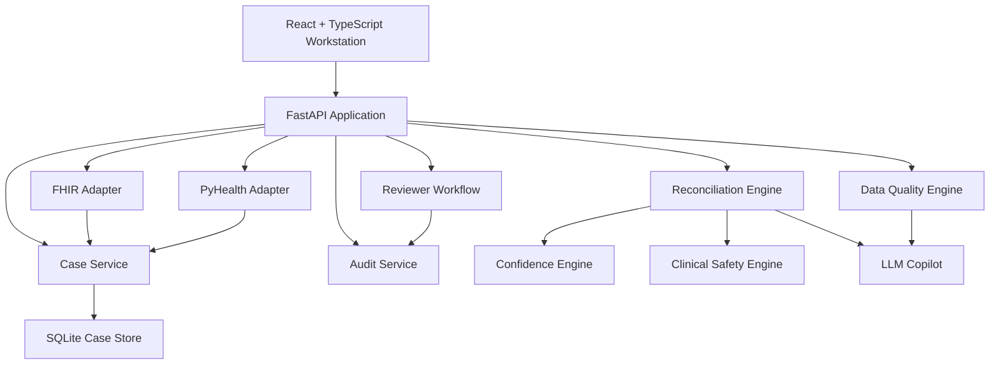

# Architecture Overview

## Objective

V2 re-positions the project from a pair of stateless demo endpoints into a persistent clinical review platform with:
- case-based workflow
- reviewer decisions
- audit events
- mock FHIR normalization
- pyhealth patient/visit/event projection
- deterministic decision support plus an LLM copilot layer

## System Shape

## Frontend

Stack:
- `React`
- `TypeScript`
- `Vite`

Current workstation layout:
- left rail
  - case queue
  - search
  - alerts
- center workspace
  - patient summary
  - reconciliation diff view
  - source table
  - timeline
  - data quality diagnostics
  - FHIR raw vs normalized viewer
- right rail
  - AI reasoning trace
  - confidence explanation
  - reviewer controls
  - risk heatmap
  - audit log

Why this matters:
- it feels like a real clinical review surface rather than a single-form take-home
- it supports drill-down and explainability
- it aligns with human-in-the-loop clinical workflow

## Backend

Stack:
- `Python`
- `FastAPI`
- `Pydantic`
- `sqlite3`

Primary modules:
- `backend/app/api/routes/`
  - case APIs
  - workflow APIs
  - reviewer APIs
  - FHIR APIs
- `backend/app/services/`
  - reconciliation engine
  - data-quality engine
  - confidence engine
  - safety engine
  - FHIR adapter
  - audit service
  - LLM copilot
- `backend/app/db/session.py`
  - database initialization and persistence

## Persistence Model

Implemented tables:
- `cases`
- `audit_events`
- `fhir_snapshots`

This gives the platform:
- persistent review cases
- durable workflow results
- auditability for reviewer actions
- stored FHIR payload snapshots

The original V2 target called for PostgreSQL and Alembic. In this repo, I used `sqlite3` to preserve persistence and workflow realism without introducing missing infrastructure dependencies.

## Request Flow

### Case-based reconciliation

1. UI selects a case
2. UI calls `POST /api/cases/{case_id}/reconciliation/run`
3. backend loads the stored case request
4. deterministic reconciliation runs
5. confidence engine adds factorized explainability
6. clinical safety engine adds severity framing
7. optional copilot layer improves explanation wording
8. result is persisted back to the case
9. audit event is written
10. UI refreshes the case and audit log

### Case-based data quality

1. UI calls `POST /api/cases/{case_id}/data-quality/run`
2. backend loads stored quality payload
3. deterministic rule engine computes:
   - overall score
   - issue breakdown
   - issue groups
   - freshness
   - field diagnostics
4. result is persisted
5. audit event is written
6. UI updates diagnostics and audit log

### Mock FHIR ingest

1. UI sends a synthetic FHIR bundle
2. backend normalizes:
   - `Patient`
   - `Condition`
   - `AllergyIntolerance`
   - `MedicationStatement`
   - `MedicationRequest`
   - `Observation`
   - `Encounter`
3. raw and normalized payloads are stored
4. the case requests are updated from the normalized records
5. UI can inspect raw vs normalized views

### PyHealth projection

1. UI or API calls `GET /api/cases/{case_id}/pyhealth/patient`
2. backend loads the stored case and latest normalized FHIR snapshot
3. backend builds real `pyhealth` objects:
   - one `Patient`
   - one case review `Visit`
   - one FHIR-derived `Visit` when snapshot data exists
   - `Event` objects for medications, conditions, allergies, vitals, and normalized FHIR records
4. backend serializes the resulting patient/visit/event structure for the UI and API consumer

This gives the project a real interoperability bridge into a healthcare ML/data library rather than a purely custom internal schema.

## Deterministic Decision Support

The source of truth is still deterministic logic.

Why:
- easier to test
- easier to defend in review
- safer for healthcare-adjacent use
- easier to show exact confidence contributors and safety checks

The reconciliation output now includes:
- selected source
- confidence score
- confidence breakdown
- reasoning trace
- source rankings
- conflict severity
- what changed diff

The data-quality output now includes:
- overall score
- grouped issues
- recommended follow-up
- record freshness
- field diagnostics

## LLM Copilot Layer

The model does not choose the medication recommendation.

It is used for:
- concise clinician-facing explanation
- readable summaries of deterministic findings
- more human-friendly reviewer context

It is constrained by:
- deterministic inputs first
- grounding to source rankings and safety flags
- fallback when the provider is unavailable
- response caching

## Security Model

Implemented:
- API-key protection on protected routes

Not yet production-grade:
- user accounts
- session auth
- role-based permissions
- compliance controls

That is intentional. This project is product-shaped and architecture-aware, not a production healthcare platform claim.

## Testing Strategy

Backend coverage includes:
- stateless API checks
- case workflow checks
- FHIR ingest checks
- reconciliation behavior checks
- data quality checks

Frontend coverage includes:
- workstation rendering
- reconciliation flow
- quality validation flow
- reviewer approval flow

## Trade-offs

1. `sqlite3` over PostgreSQL
   - chosen for portability in the current environment
   - preserves persistence and auditability without blocking on missing packages
2. deterministic engine over LLM-led decisions
   - stronger explainability
   - safer demo posture
   - easier testability
3. case workflow plus compatibility endpoints
  - keeps the app rubric-friendly
  - also upgrades it into a more realistic review platform
4. `pyhealth 1.1.6` adapter over notebook `2.x` assumptions
   - implemented against the actual installed library version in the repo environment
   - avoids claiming support for an API that is not what this project runs locally

## Next Steps

1. migrate persistence to PostgreSQL + Alembic
2. add reviewer identity and auth roles
3. enrich FHIR provenance and normalization
4. add end-to-end browser tests
5. add hosted deployment and observability
